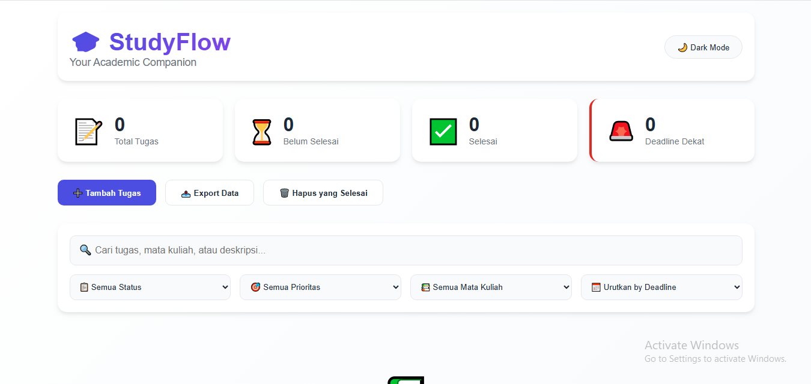
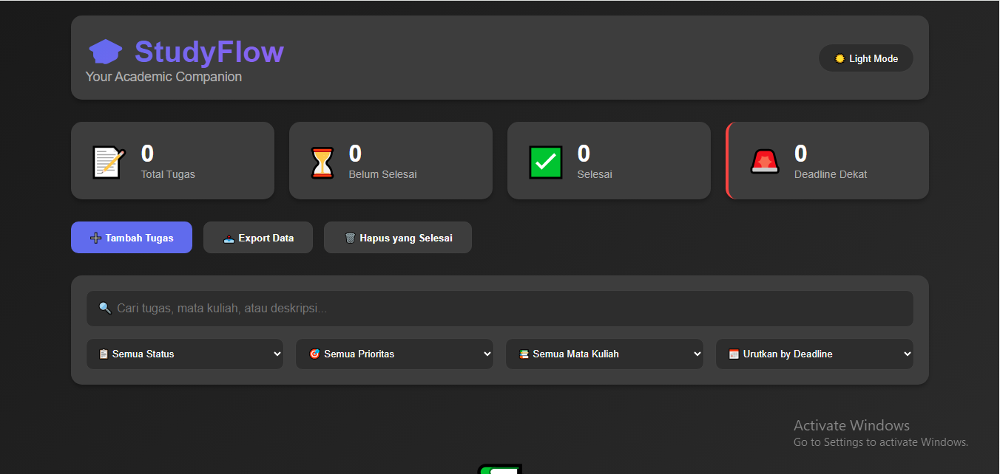
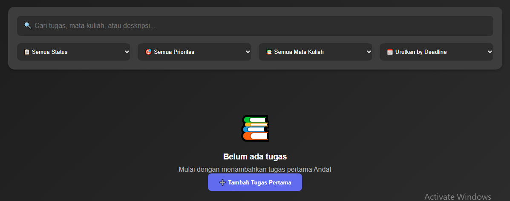

# StudyFlow - Aplikasi Manajemen Tugas Mahasiswa

**Nama**: Abel Fortino  
**NIM**: 123140111  
**Kelas**: RA

## Deskripsi
StudyFlow adalah aplikasi web comprehensive untuk manajemen tugas akademik mahasiswa. Aplikasi ini dilengkapi dengan fitur-fitur advanced termasuk sistem prioritas, multiple filtering, theme customization, dan data export capabilities.

## Fitur

### Fitur Inti
- **Manajemen Tugas Lengkap**: Create, Read, Update, Delete operations
- **Sistem Prioritas**: Tiga level prioritas (Tinggi, Sedang, Rendah)
- **Advanced Filtering**: Filter berdasarkan status, prioritas, dan mata kuliah
- **Multiple Sorting**: Pengurutan berdasarkan deadline, prioritas, dan lainnya
- **Real-time Search**: Pencarian instan across semua field tugas
- **Comprehensive Statistics**: Dashboard dengan multiple metrics

### Fitur Tambahan
- **Theme System**: Dark dan Light mode dengan persistence
- **Deadline Notifications**: Peringatan untuk tugas mendekati deadline
- **Data Export**: Backup data ke format JSON
- **Bulk Operations**: Hapus massal tugas yang completed
- **Responsive Design**: Optimal pada berbagai device sizes
- **Form Validation**: Validasi comprehensive dengan user feedback

## Screenshot

### 1. Dashboard dengan Statistik

*Dashboard aplikasi dengan statistical overview*

### 2. Dark Mode Interface

*Tampilan dark mode dengan priority color coding*

### 3. Advanced Filtering Modal

*Interface filtering dan editing yang advanced*

## Panduan

### Requirements
- Modern web browser dengan JavaScript support
- LocalStorage capability
- Minimum screen resolution: 320px width

### Installation Steps
1. Download seluruh konten folder version2
2. Buka file `index.html` di web browser
3. Aplikasi ready untuk digunakan

### User Guide
1. **Task Creation**: Klik "Tambah Tugas" dan isi form dengan valid data
2. **Task Management**: Gunakan action buttons untuk edit, complete, atau delete
3. **Filtering**: Gunakan multiple filter options untuk view customization
4. **Theme Switching**: Toggle between dark dan light mode via header button
5. **Data Export**: Gunakan export feature untuk data backup

## Aspek Teknis

### LocalStorage Implementation
Aplikasi menggunakan robust localStorage implementation dengan error handling:

```javascript
class StorageManager {
    saveTasks(tasks) {
        try {
            localStorage.setItem('tasks', JSON.stringify(tasks));
        } catch (error) {
            this.handleStorageError(error);
        }
    }
    
    loadTasks() {
        try {
            return JSON.parse(localStorage.getItem('tasks')) || [];
        } catch (error) {
            return []; // Fallback mechanism
        }
    }
}
```

**Data Structure:**
```javascript
{
    id: Number,
    name: String,
    course: String,
    deadline: String,
    priority: String,
    description: String,
    completed: Boolean,
    createdAt: String
}
```

### Form Validation System
Comprehensive validation system dengan detailed feedback:

```javascript
validateForm(data) {
    const errors = {};
    
    if (!data.name.trim() || data.name.length < 3) {
        errors.name = 'Nama tugas harus diisi (min. 3 karakter)';
    }
    
    if (!data.course.trim()) {
        errors.course = 'Mata kuliah harus diisi';
    }
    
    if (!data.deadline || new Date(data.deadline) < new Date()) {
        errors.deadline = 'Deadline harus diisi dan valid';
    }
    
    return errors;
}
```

**Validation Rules:**
- Nama tugas: Required, minimum 3 characters
- Mata kuliah: Required field
- Deadline: Required, must be future date
- Priority: Auto-validated dengan default value
- Description: Optional field

### Advanced Features Technical Details

#### Theme Management
```javascript
class ThemeManager {
    constructor() {
        this.currentTheme = this.loadTheme();
    }
    
    toggleTheme() {
        this.currentTheme = this.currentTheme === 'dark' ? 'light' : 'dark';
        this.applyTheme(this.currentTheme);
        this.saveTheme(this.currentTheme);
    }
}
```

#### Sorting Algorithm
```javascript
sortTasks(tasks, criteria) {
    switch(criteria) {
        case 'priority':
            return this.sortByPriority(tasks);
        case 'deadline':
            return this.sortByDeadline(tasks);
        case 'name':
            return this.sortByName(tasks);
        default:
            return tasks;
    }
}
```

## Project Structure
```
├── index.html          # Main application file
├── style.css           # Styling dengan theme system
└── script.js           # Application logic dan features

```
