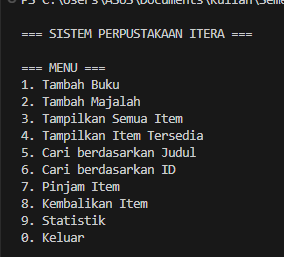
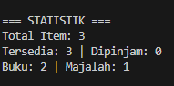

# Sistem Manajemen Perpustakaan

## Deskripsi Program
Program ini adalah sistem manajemen perpustakaan sederhana yang dibangun menggunakan konsep Object-Oriented Programming (OOP) dalam Python. Program dapat mengelola koleksi buku dan majalah dengan fitur peminjaman dan pengembalian.

## Fitur Program
1. Menambah Buku dan Majalah
2. Menampilkan semua item perpustakaan
3. Menampilkan item yang tersedia
4. Mencari item berdasarkan judul
5. Mencari item berdasarkan ID
6. Peminjaman item
7. Pengembalian item
8. Melihat statistik perpustakaan

## Konsep OOP yang Diterapkan

### 1. Abstract Class dan Inheritance
- `LibraryItem` sebagai abstract base class
- `Book` dan `Magazine` mewarisi dari `LibraryItem`
- Implementasi abstract methods: `display_info()` dan `get_type()`

### 2. Encapsulation
- Private attributes menggunakan `__` (double underscore)
- Protected attributes menggunakan `_` (single underscore)
- Contoh: `__item_id`, `__title`, `_year`, `_is_available`

### 3. Property Decorators
- Getter dan setter untuk atribut dengan validasi
- Contoh: `@property` untuk `item_id`, `title`, `year`
- Read-only property untuk `item_id`

### 4. Polymorphism
- Method `display_info()` diimplementasikan berbeda di Book dan Magazine
- Method `__str__()` untuk representasi string yang berbeda
- Duck typing dalam Library class

## Struktur File
```
abel_123140111_pertemuan5/
├── library_item.py    
├── book.py           
├── magazine.py       
├── library.py        
├── main.py           
└── README.md       
```

## Cara Menjalankan Program

1. Pastikan Python 3.x sudah terinstall
2. Buka terminal/command prompt
3. Jalankan program:
```bash
python main.py
```

## Screenshot Program

*Menu utama sistem perpustakaan*


*Menampilkan daftar item perpustakaan*

## Contoh Penggunaan

### Menambah Buku
```
ID: B003
Judul: Belajar OOP Python
Penulis: John Doe
ISBN: 978-111-222-333-4
Tahun: 2024
```

### Mencari Item
```
Judul: Python
Hasil: Menampilkan semua item yang mengandung kata "Python"
```

### Meminjam Item
```
ID: B001
Output: Berhasil meminjam: Pemrograman Python
```

## Konsep Teknis

### Encapsulation
Private methods seperti `__find_by_id()` di Library class tidak dapat diakses dari luar, memastikan data integrity.

### Inheritance
Book dan Magazine mewarisi semua atribut dan method dari LibraryItem, menambahkan atribut spesifik mereka sendiri.

### Polymorphism
Setiap subclass mengimplementasikan `display_info()` dengan cara yang berbeda sesuai kebutuhan.